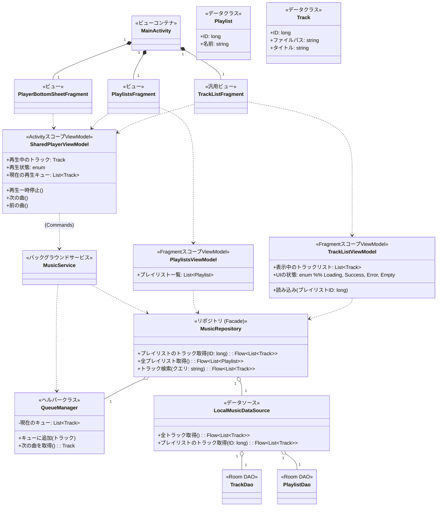

```mermaid
classDiagram
    %% --- View層 ---
    class MainActivity {
        <<ビューコンテナ>>
    }
    class TrackListFragment {
        <<汎用ビュー>>
        %% ライブラリ、プレイリスト詳細、キューの表示を担当
    }
    class PlaylistsFragment {
        <<ビュー>>
        %% ユーザー作成プレイリストの一覧表示を担当
    }
    class PlayerBottomSheetFragment {
        <<ビュー>>
        %% ミニプレイヤーとフルスクリーンプレイヤーを担当
    }

    %% --- ViewModel層 ---
    class SharedPlayerViewModel {
        <<ActivityスコープViewModel>>
        +再生中のトラック: Track
        +再生状態: enum
        +現在の再生キュー: List~Track~
        +再生一時停止()
        +次の曲()
        +前の曲()
    }
    class TrackListViewModel {
        <<FragmentスコープViewModel>>
        +表示中のトラックリスト: List~Track~
        +UIの状態: enum %% Loading, Success, Error, Empty
        +読み込み(プレイリストID: long)
    }
    class PlaylistsViewModel {
        <<FragmentスコープViewModel>>
        +プレイリスト一覧: List~Playlist~
    }

    %% --- Model層 ---
    class MusicService {
        <<バックグラウンドサービス>>
        %% ExoPlayerとMediaSessionの管理
    }
    class MusicRepository {
        <<リポジトリ (Facade)>>
        +プレイリストのトラック取得(ID: long): Flow~List~Track~~
        +全プレイリスト取得(): Flow~List~Playlist~~
        +トラック検索(クエリ: string): Flow~List~Track~~
    }
    class QueueManager {
        <<ヘルパークラス>>
        -現在のキュー: List~Track~
        +キューに追加(トラック)
        +次の曲を取得(): Track
    }
    class LocalMusicDataSource {
        <<データソース>>
        +全トラック取得(): Flow~List~Track~~
        +プレイリストのトラック取得(ID: long): Flow~List~Track~~
    }
    class TrackDao {
        <<Room DAO>>
    }
    class PlaylistDao {
        <<Room DAO>>
    }
    class Playlist {
        <<データクラス>>
        +ID: long
        +名前: string
    }
    class Track {
        <<データクラス>>
        +ID: long
        +ファイルパス: string
        +タイトル: string
    }

    %% --- View層の関係 ---
    MainActivity "1" *-- "1" TrackListFragment
    MainActivity "1" *-- "1" PlaylistsFragment
    MainActivity "1" *-- "1" PlayerBottomSheetFragment

    %% --- ViewModelとViewの関係 ---
    %% ActivityスコープのViewModelは複数のFragmentから参照される
    TrackListFragment ..> SharedPlayerViewModel
    PlaylistsFragment ..> SharedPlayerViewModel
    PlayerBottomSheetFragment ..> SharedPlayerViewModel

    %% FragmentスコープのViewModelは1対1
    TrackListFragment ..> TrackListViewModel
    PlaylistsFragment ..> PlaylistsViewModel
    
    %% --- ViewModelとModelの関係 ---
    SharedPlayerViewModel ..> MusicService : (Commands)
    TrackListViewModel ..> MusicRepository
    PlaylistsViewModel ..> MusicRepository

    %% --- Model層の内部関係 (委譲と依存) ---
    %% RepositoryがDataSourceを利用する
    MusicRepository "1" o-- "1" LocalMusicDataSource
    MusicRepository "1" o-- "1" QueueManager
    
    %% ServiceがRepositoryやQueueManagerを利用する
    MusicService ..> MusicRepository
    MusicService ..> QueueManager

    %% DataSourceがDAOを利用する
    LocalMusicDataSource "1" o-- "1" TrackDao
    LocalMusicDataSource "1" o-- "1" PlaylistDao
```
